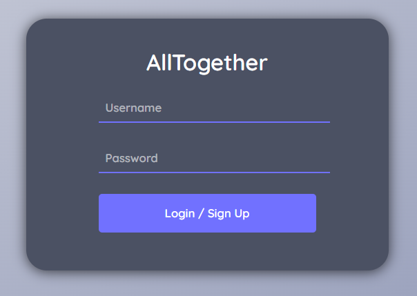

# NextJS Chat Tutorial

# Login/Sign Up

This project is powered by [Chat Engine](https://chatengine.io).

## Setup

Code > Download Zip

Create your own repo then follow instructions below before commiting and pushing project

Link to [vercel](https://vercel.io) or [glitch](glitch.com)

## Setup Finished Project

Go to [Chat Engine](https://chatengine.io) and create a account and project.

Find the Private Key and Project ID and replace the values with your API keys.

### `yarn dev`

Install everything with `yarn` then run `yarn dev` to get up and running.
