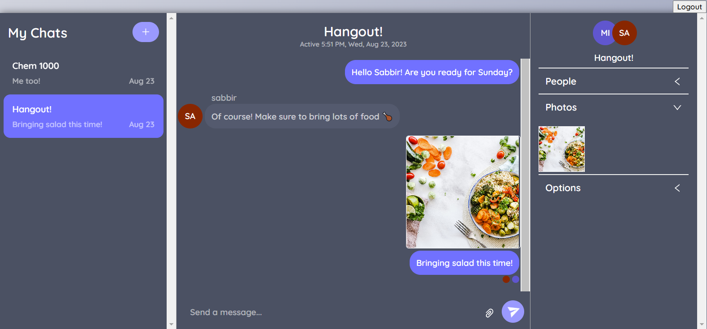

# AllTogether Chat App

Link: https://chat-nextjs-three.vercel.app/

For testing, please use these logins:

user: mir, &nbsp; &nbsp; &nbsp; pass: hello

user: sabbir, &nbsp; pass: world

user: brainy, &nbsp; pass: math

user: messi, &nbsp; &nbsp;pass: mess

user: renaldo, pass: penalty

# Login/Sign Up

# Chat Page

This project is powered by [Chat Engine](https://chatengine.io).

## Setup

Code > Download Zip

Create your own repo then follow instructions below before commiting and pushing project

Link to [vercel](https://vercel.io) or [glitch](glitch.com)

## Instructions

Go to [Chat Engine](https://chatengine.io) to create an account and project.

Note the Private Key and Project ID

Go to .env_sample and replace YOUR_PRIVATE_KEY_HERE with your private key and YOUR_PROJECT_ID_HERE with your project ID

Rename .env_sample to .env

### `yarn dev`

Install everything with `yarn` then run `yarn dev` to get up and running.
